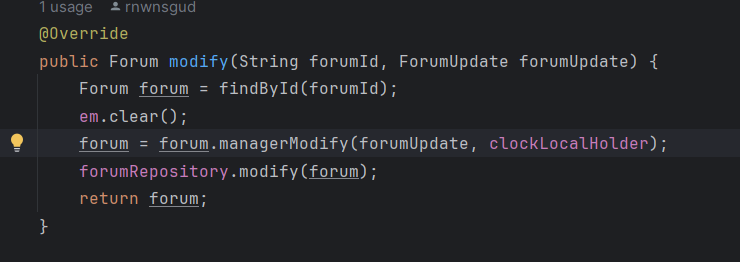
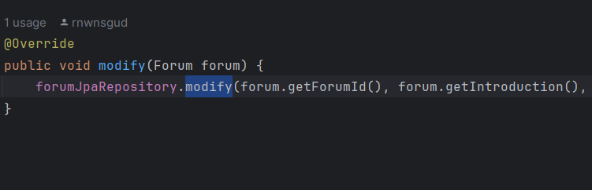

# Board

---

**인터넷 커뮤니티 포털 사이트 기능 구현 프로젝트**

**개발기간 : 2024/01/21 ~ 현재 진행중**

---

[Board API 명세서](https://thundering-vulture-ff9.notion.site/Board-b3768219329e43d78ac304eef4d3a71a)

# **📝**규칙

- `**커밋 컨벤션**`
    - Feat : 새로운 기능 추가
    - Test :  테스트 코드 추가
    - Refactor : 코드 리팩토링
    - Docs : 문서 수정
    - FIX : 사소한 오류 수정
    - Issue : 오작동, 심각한 오류 수정

- `**엔티티에서 인스턴스 반환 시, 정적 팩토리 메서드 사용**`
    - 테스트코드를 제외한 외부에서 빌더 및 생성자 제한
    - JPA 엔티티에 @Builder(access = AccessLevel.PRIVATE)
    
- `**UPDATE @Query 사용 규칙**`
    - Service → Repository 호출에서 도메인 객체 전달
    
    
    
    - Repository → JpaRepository 호출에서 도메인 파라미터 전달
    
    